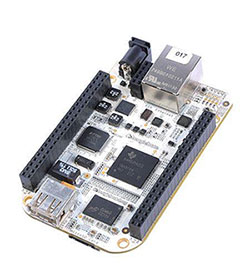
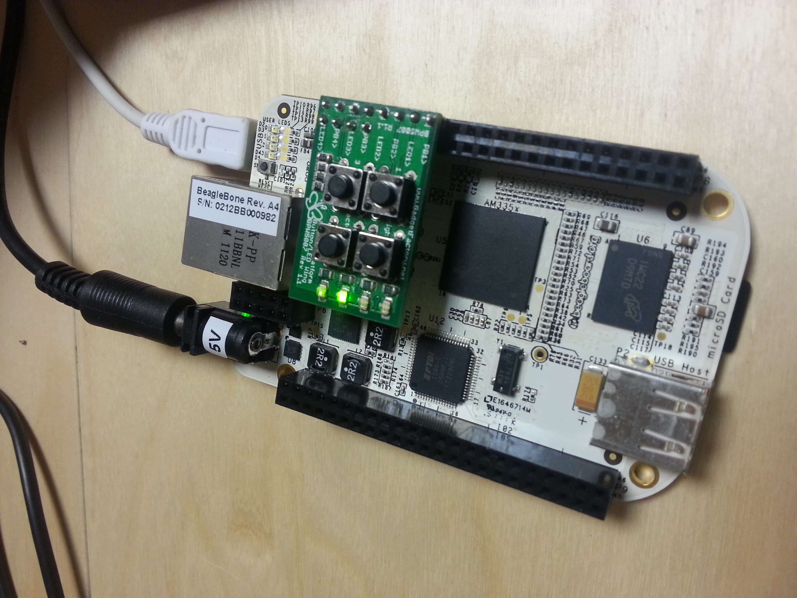

# BeagleBone White
Backup of my original post [here](https://wiki.logre.eu/index.php/BeagleBone_White).



You can also look at the page [BeagleBone Black](https://wiki.logre.eu/index.php/BeagleBone_Black) (french)

## Howto set up a BeagleBone White board for PRU development

I took inspiration on [Fma38](https://wiki.logre.eu/index.php/Utilisateur:Fma38)'s repository for BeagleBone Black :
https://github.com/fma38/BeagleBone.git

### Minimum setup to let a PRU blink external leds on GPIOs

#### Setup a standard debian image for BeagleBone

* It will be installed on a 4GB SD card
* Debian image is available [http://beagleboard.org/latest-images here]
* all needed toolchains (gcc, pasm, gdb, etc..) are already shipped

#### setup the minimal project

* build a DeviceTreeOverlay (overlay.dtso => overlay.dtbo)
* build the PRU firmware (pru0.p => pru0.bin)
* build a user application as the PRU loader (loader.c => loader)

You can find the code in my github repos :
https://github.com/nsauzede/hellopruss

#### Run Firmware

The minimal PRU firmware just blinks leds connected GPIO on port P8.
For this setup, I re-used LED-Button wing for the papilio FPGA board :
http://papilio.cc/index.php?n=Papilio.BLEDWing

The SRF for the Rev A4 of the BBW is [here](https://github.com/CircuitCo/BeagleBone-RevA4/blob/master/BeagleBone_revA4_SRM.pdf?raw=true)\
Just in case, here is a [local backup](BeagleBone_revA4_SRM.pdf).

The pinout (almost 2 columns) of the LED-Button wing, looking at the top of it is :

```
8(PB1)
7(LED1)
6(PB2)
5(LED2)
4(PB3)  5V  (nc)
3(LED3) 3V3 (nc)
2(PB4)  2V5 (nc)
1(LED4) GND
```

The pinout of the top-right header (P8) of the BBW (looking at the top of the board) is :

```
Format is : P8_pin (GPIO_name pin_number address_offset) x2

 1(GND)                2(GND)
 3(GPIO1_6  pin32 80)  4(GPIO1_7  pin33 84)
 5(GPIO1_2  pin34 88)  6(GPIO1_3  pin35 8c)
 7(GPIO2_2  pin36 90)  8(GPIO2_3  pin37 94) *mode7 is not default
 9(GPIO2_5  pin38 98) 10(GPIO2_4  pin39 9c) *mode7 is not default
11(GPIO1_13 pin40 a0) 12(GPIO1_12 pin41 a4)
13(GPIO0_23 pin42 a8) 14(GPIO0_26 pin43 ac)
15(GPIO1_15 pin44 b0) 16(GPIO1_14 pin45 b4)
17(GPIO0_27 pin46 b8) 18(GPIO2_1  pin47 bc)
...
```

Here we plug the led_button wing (rotated 45 degrees) pins GND/LED1-4 to the BeagleBone White pins P8.3/P8.18

Note:
In order to learn about different pin number/address, you can issue :
```
root@beaglebone:~# cat /sys/kernel/debug/pinctrl/44e10800.pinmux/pinmux-pins |head -n 60
Pinmux settings per pin
Format: pin (name): mux_owner gpio_owner hog?
pin 0 (44e10800): (MUX UNCLAIMED) (GPIO UNCLAIMED)
pin 1 (44e10804): (MUX UNCLAIMED) (GPIO UNCLAIMED)
...
pin 31 (44e1087c): (MUX UNCLAIMED) (GPIO UNCLAIMED)
pin 32 (44e10880): 4a300000.pruss (GPIO UNCLAIMED) function pinmux_servos_pins group pinmux_servos_pins
pin 33 (44e10884): 4a300000.pruss (GPIO UNCLAIMED) function pinmux_servos_pins group pinmux_servos_pins
pin 34 (44e10888): 4a300000.pruss (GPIO UNCLAIMED) function pinmux_servos_pins group pinmux_servos_pins
pin 35 (44e1088c): 4a300000.pruss (GPIO UNCLAIMED) function pinmux_servos_pins group pinmux_servos_pins
...
```

```shell
$ make load_pru              (must be sudoer)
```



## References

* [Conférence_BBB|Workshop BeagleBone Black](https://wiki.logre.eu/index.php/Conf%C3%A9rence_BBB)
